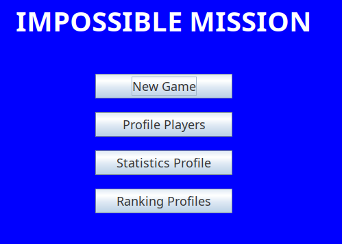
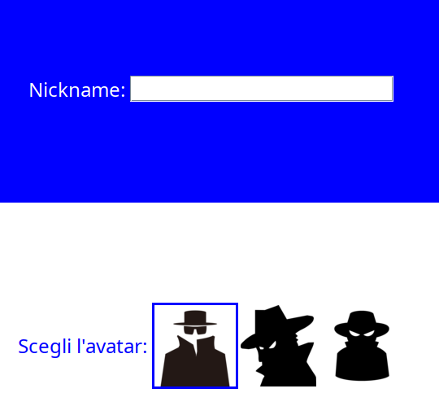
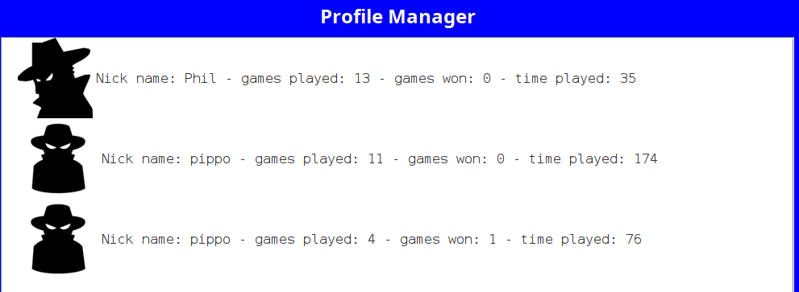
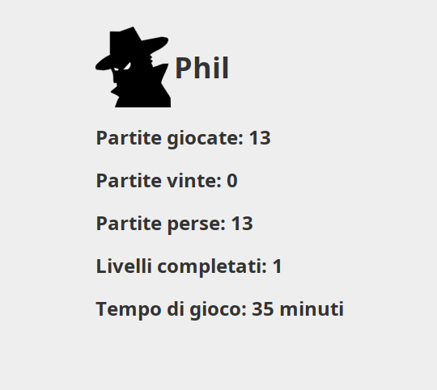
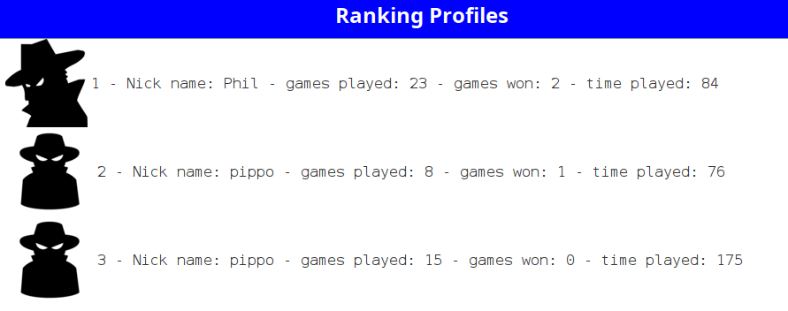
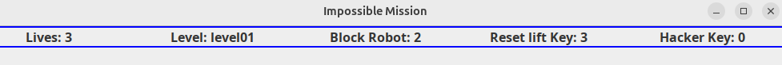
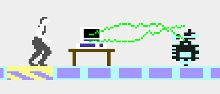
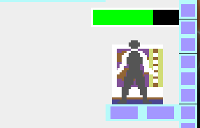
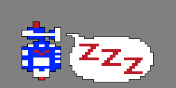

# JImpossibleMission

A 2D platformer in Java, inspired by the 1984 Epyx arcade classic *Impossible Mission*. A spy must infiltrate a robot-guarded complex, search furniture for hidden clues, hack computers, and escape before time runs out.

> Built as an exercise in object-oriented design — the gameplay is the excuse, the architecture is the point.

<p align="center">
  
</p>

---

## At a glance

| | |
|---|---|
| Language | Java 21 |
| GUI | Swing / AWT, custom rendering with `Graphics2D`, `CardLayout` for rooms, `JLayeredPane` for overlays |
| Game loop | 60 FPS via `javax.swing.Timer` |
| Codebase | ~117 classes, ~8,100 LOC |
| Levels | 15 hand-authored levels across 3 floors, defined in JSON (`org.json`) |
| Persistence | Java serialization (user profiles, stats, rankings) |
| Audio | WAV samples via `javax.sound.sampled`, pooled with a Flyweight registry |

---

## Why this project is interesting

Most platformer tutorials end at "moving sprite on a tile map". This project is what happens when you keep going — and treat a small game as a sandbox for the design problems you actually meet in production code:

- **Decoupling concerns** so the renderer doesn't know about input and the AI doesn't know about audio.
- **Making behavior swappable at runtime** (enemy AI) without conditionals branching everywhere.
- **Adding new entity types** without touching the rendering core (reflection-based view factory).
- **Modeling state machines** that are easy to reason about and easy to extend.

The result is a codebase where adding a new enemy, a new collectible, or a new screen is a *small* change in *one* place.

---

## Architecture

A classic **MVC** split, with `model/`, `view/`, and `controller/` as top-level packages. Full UML diagrams are committed alongside the source:

- [`ImpossibleMission-model.drawio.pdf`](ImpossibleMission-model.drawio.pdf)
- [`ImpossibleMission-view.drawio.pdf`](ImpossibleMission-view.drawio.pdf)
- [`ImpossibleMission-controller.drawio.pdf`](ImpossibleMission-controller.drawio.pdf)
- [`ImpossibleMission-main.drawio.pdf`](ImpossibleMission-main.drawio.pdf)

### Design patterns — where and why

| Pattern | Where | What it buys |
|---|---|---|
| **MVC** | top-level packages | Model is pure data + rules; view only renders; controller drives the loop and routes input |
| **Observer** | `Game`, `Player`, `Navigator`, `LevelManager`, `AudioManager` | Player notifies audio of state changes — no direct coupling. Same mechanism powers UI navigation |
| **Strategy** | `MoveStrategy`, `AttackStrategy` and implementations | Enemy behavior (patrol, follow, electric attack, laser attack) is composable and swappable at runtime |
| **Command** | `CommandBehaviour`, `InputHandler`, `InputFactory` | Keyboard input becomes first-class command objects — easy to rebind, queue, or replay |
| **Factory + Reflection** | `GameObjectViewFactory`, `SpriteFactory`, `InputFactory` | Adding a new model entity doesn't require touching the view layer; the factory resolves the matching view by class name |
| **Flyweight** | `SpriteFactory` cache, `AudioManager.AudioClipRegistry` | Sprites and audio clips are loaded once and reused — keeps memory flat and stops the GC fight on long sessions |
| **State** | `GameState`, `PlayerState`, `RobotState` | Explicit enums with transitions — no boolean soup, no hidden modes |
| **Template Method** | `DynamicObject`, `Enemy` | Shared movement / lifecycle skeleton, subclasses fill in the specifics |
| **Singleton** | `LevelManager`, `CollisionManager`, `AudioManager` | Controlled global access to genuinely shared, stateful resources |
| **Marker Interface** | `CanCollide`, `CanFall`, `CanJump` | Capability-style typing — query what an object *can do*, not what it *is* |

### A few engineering notes

- **`Stream<T>` is used as a real tool**, not a syntactic flourish — filtering active collidables, computing enemy targeting, building rankings, aggregating user statistics, pipelining level objects during load.
- **Reflection in `GameObjectViewFactory`** resolves the view for any model entity from its class name (`Player` → `PlayerView`, `Robot` → `RobotView`, …). Adding a new entity is a *one-class* change: drop in the model, drop in the matching view, the factory finds it. The same trick is used for attack-strategy views from their interface name.
- **Generics with a bounded wildcard** — `Level<T extends GameObject>` aggregates heterogeneous entities. Stream pipelines work around runtime type erasure with explicit `instanceof` filters before casting, instead of leaking type knowledge to callers.
- **Collision detection** is bounding-box (`BoxCollider`) with a single `CollisionManager` arbitrating pairs — keeps per-entity code free of "do I overlap with X?" branching.
- **Game state machine**: `START → PLAY → (PAUSE | VICTORY | GAMEOVER)`. Transitions are explicit; no scattered booleans.
- **Persistence** is intentionally simple: profiles serialize to `games.db`. Trade-off chosen consciously — the project is a design showcase, not a database benchmark.

### Measured, not assumed: stream vs `parallelStream`

In `CollisionManager`'s platform-overlap query I benchmarked both. With the actual dataset (a few dozen objects per level, lightweight predicate) the sequential stream consistently wins:

| Variant | Range observed (ns) |
|---|---|
| `stream()` | ~15,000 – 59,000 |
| `parallelStream()` | ~70,000 – 91,000 |

For small datasets and cheap predicates, `parallelStream` pays a fork/join setup tax that the workload never amortizes. Sequential was kept; the experiment is left documented so the choice is *visible*, not folklore.

---

## Gameplay highlights

- Running, jumping, falling with simulated gravity
- 3 lives, damage and death animations
- 15 rooms across 3 floors, connected by floor-elevators and intra-room lifts
- Interactive furniture (jukebox, bookshelf, desk, fridge, …) hiding three kinds of badges: `lift_reset`, `block_enemy`, `hacker_key`
- Hackable computers (consume badges to pause enemies or reset lifts) and a final super-computer to complete the mission
- Two enemy archetypes with composable AI:
  - **Robot** — `patrol` or `watch` movement, paired with `laser`, `electric`, or `electric-timed` attack
  - **Big Bomb** — `follow` movement, contact attack
- Temporary enemy lockdown ("zZz" state) consuming a `block_enemy` badge
- Iconic audio cues from the original (*"Another visitor… Stay a while… Stay forever!"*)
- Persistent user profiles with custom avatar, stats, and a cross-profile ranking

### Screenshots

<p align="center">
  
  
</p>
<p align="center">
  
  
</p>

In-game HUD — lives, current level, and the three badge counters:

<p align="center">
  
</p>

A laser-equipped patrol robot, the hacking interaction, and an enemy temporarily disabled by a `block_enemy` badge:

<p align="center">
  
  
  
</p>

---

## Build & run

**Requirements:** JDK 8 or higher · [`json-20251224.jar`](https://github.com/stleary/JSON-java) on the classpath.

```bash
# Compile
javac -cp lib/json-20251224.jar -d bin -sourcepath src \
      src/jimpossiblemission/JImpossibleMission.java

# Run
java -cp bin:lib/json-20251224.jar:resources \
     jimpossiblemission.JImpossibleMission
```

From any Java IDE: import the project, add `json-20251224.jar` to the classpath, run `JImpossibleMission`.

---

## API documentation

Full Javadoc lives in [`doc/`](doc/). Every public class is documented; each package ships a `package-info.java` overview.

---

## What's next

A short list of extensions the architecture is already shaped to absorb cheaply:

- **JSON level validation** (and ideally a TDD harness around it) so authoring new rooms can't silently break the game.
- **Non-rectangular colliders** — adding `CircleCollider` next to `BoxCollider` without touching `CollisionManager`. The interface is there; the geometry isn't yet.
- **New attack effects** — drop in a new `AttackStrategy` + matching `AttackStrategyView`. Reflection picks it up.
- **New enemy AIs** — register new `MoveStrategy` / `AttackStrategy` in the respective factories.
- **More rooms** — purely data: edit `levels.json`, no code changes.

---

## Credits

- **Filippo Taiuti** — design and implementation (individual project).
- **Cicio Ionut** — author of the `Navigator` component, adapted here from his *Minesweeper* tutorial; the user-profile serialization approach also took inspiration from the same tutorial.

Original *Impossible Mission* is © Epyx, 1984. This is a non-commercial homage built for learning.
